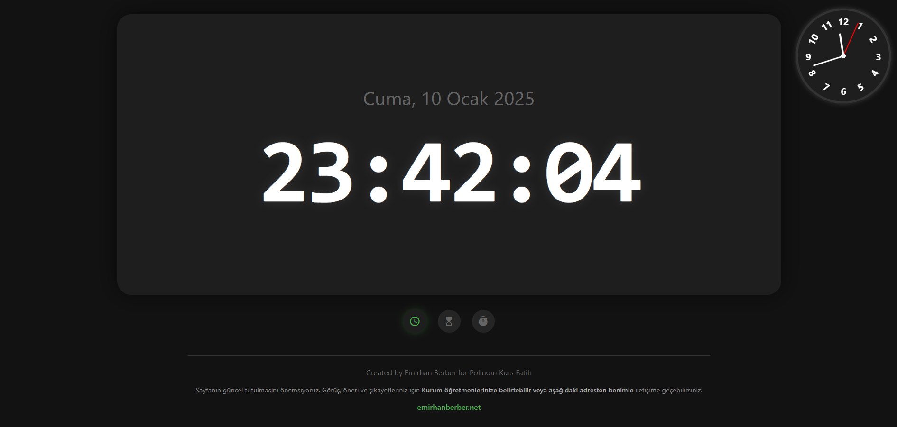
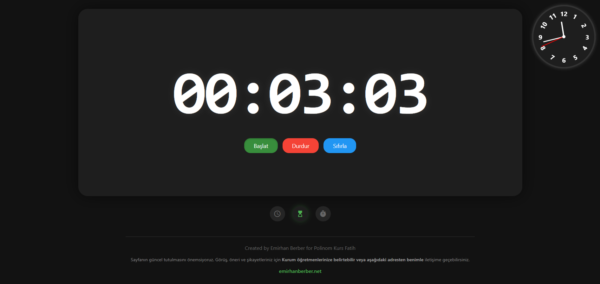
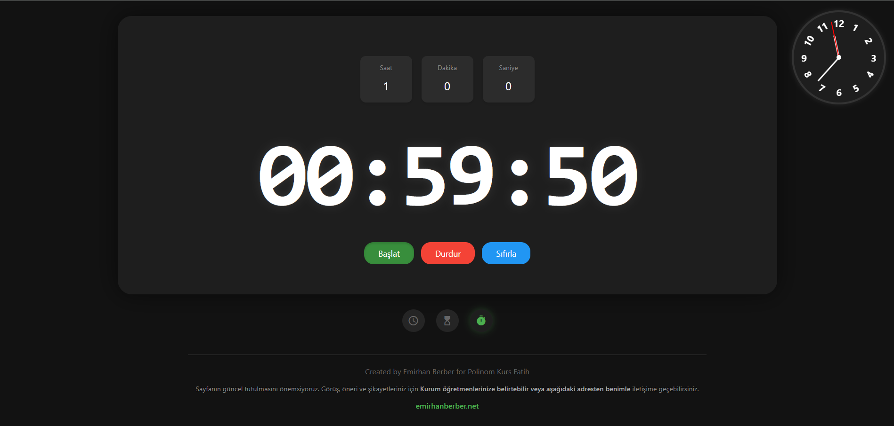

# ⏰ Reklamsız Online Saat
Bu proje, Yükseköğretim Kurumları Sınavı (YKS) hazırlık sürecinde, eğitim kurumlarında gerçekleştirilen deneme sınavları sırasında kullanılan online saat sitelerindeki gereksiz reklamlar ve dikkat dağıtıcı unsurların oluşturduğu sorunlara çözüm olması amacıyla kullanılarak geliştirilmiştir.

🎯 **Amaç**  
Bu proje, YKS hazırlık sürecinde girdiğim deneme sınavlarında kullanılan saat sitelerindeki:  
- 🚫 Gereksiz reklamlar,  
- ⚠️ Dikkat dağıtıcı öğeler sorununa çözüm olarak geliştirildi.  

## 🛠️ Kullanılan Teknolojiler  
- 🌐 **HTML5**: Temel yapıyı oluşturmak için.  
- 🎨 **CSS3**: Minimalist ve sade tasarım için.  
- 💻 **JavaScript**: Dinamik saat işlevselliği.  
- 📱 **Responsive Tasarım**: Mobil ve masaüstü cihazlarda kusursuz görünüm.  

## ✨ Özellikler  
- 🔍 **Reklamsız ve Temiz Arayüz**: Sadece saate odaklanmanız için tasarlandı.  
- 💡 **Minimalist Tasarım**: Dikkatinizi dağıtmayan sade bir görünüm.  
- 📱 **Mobil Uyumlu**: Hem telefon hem bilgisayarlar için optimize edildi.  

---

## 🚀 Projeyi Canlı İzleme
Projeyi emirhanberber.net adresini ziyaret ederek görüntüleyebilirsin!

---

## 📸 Ekran Görüntüleri
---
### ⏰ Saat Ekranı Görseli

### ⏰ Kronometre Ekranı Görseli

### ⏰ Geri Sayım Ekranı Görseli

